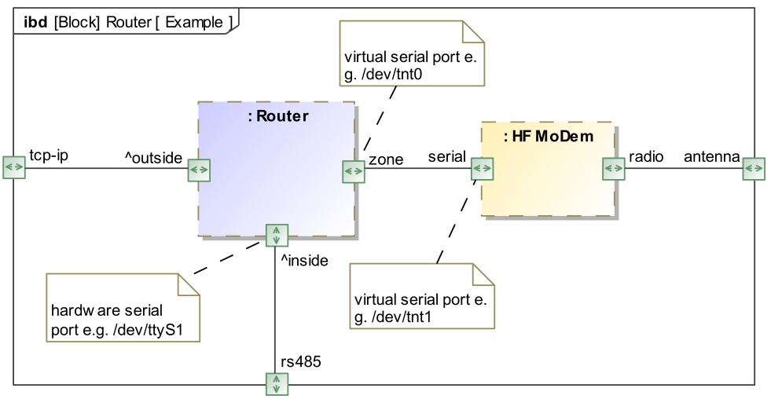

# libmodbuspp

_Much more than a C++ wrapper for the libmodbus library_

## Abstract

The libmodbuspp library provides a C++ overlay to [libmodbus](https://libmodbus.org/), 
a wrapper, having no other dependency than libmodbus and libstdc++. 
libmodbuspp is a free software library to send/receive data according to the MODBUS protocol. 
This library supports RTU (serial) and TCP (Ethernet) communications.
libmodbussp allows you to implement MODBUS servers and clients.
libmodbussp will be used in version 2 of the utility [mbpoll](https://github.com/epsilonrt/mbpoll).
Like libmodbus, libmodbuspp is cross-platform and can be compiled on
Gnu/Linux and other Unix, Windows™ and macOS™.

The [Modbus::Master](http://www.epsilonrt.fr/modbuspp/classModbus_1_1Master.html)
class allows you to design clients (also called masters), who communicate with 
servers (also called slaves).
That is, Modbus::Master can read or write data to slaves.
To do this, Modbus::Master is associated with the 
[Modbus::Slave](http://www.epsilonrt.fr/modbuspp/classModbus_1_1Slave.html) 
class which allows to perform the read and write operations, 
here are an example of use:

```cpp
uint16_t values[2]; // array to store the values of the input registers
Master mb (Rtu, "COM1", "19200E1"); // new master on RTU
Slave & slv = mb.addSlave (33); // to the slave at address 33
mb.open(); // open a connection
slv.readInputRegisters (1, values, 2);
cout << values[0] << endl;
cout << values[1] << endl;
```

This example reads the input registers number 1 and 2 of the MODBUS slave 
(server) at address 33. The source code of this program is searchable
in the examples folder 
[read-input-registers](https://github.com/epsilonrt/libmodbuspp/blob/master/examples/master/read-input-registers/main.cpp)

The [Modbus::Server](http://www.epsilonrt.fr/modbuspp/classModbus_1_1Server.html) 
class is used to design servers. An object of the class Modbus::Server allows to 
implement one or **more** slaves that can be dissociated by the use of a different address.
The Modbus::Server class is associated with the 
[Modbus::BufferedSlave](http://www.epsilonrt.fr/modbuspp/classModbus_1_1BufferedSlave.html) 
class to implement slaves.
Modbus::BufferedSlave used by Modbus::Server is derived from Modbus::Slave
used by Modbus::Master, it allows to define data blocks corresponding to each 
MODBUS entity: input registers, discrete inputs, holding registers and coils. 

Here is an example of use:

```cpp
// ModBus Data
bool daylight;// daylight saving time, true = summer time
Data<int32_t> gmtoff; // GMT offset, +/- minutes
uint16_t mb_time[8]; // date and time
Server srv (Tcp, "127.0.0.1", "1502"); // new Modbus Server on TCP/IP
BufferedSlave & slv = srv.addSlave (10); // Adding a new slave to the server
// defines the data blocks of our slave slv
slv.setBlock (InputRegister, 8); // date and time
slv.setBlock (HoldingRegister, 2); // GMT offset, +/- minutes
slv.setBlock (Coil, 1); // daylight saving time, ON = summer time
//...
slv.writeCoil (1, daylight);
slv.writeRegister (1, gmtoff);
if (srv.open ()) { // open a connection
  for (;;) {
    now = time (nullptr);
    if (now > before) {
      before = now;
      // update daylight saving time from holding register
      slv.readCoil (1, daylight);
      // update GMT offset from holding register
      slv.readRegister (1, gmtoff);
      // calculate the epoch time
      now += (daylight ? 3600 : 0) + gmtoff;
      t = gmtime (&now);
      mb_time[0] = t->tm_sec;
      mb_time[1] = t->tm_min;
      mb_time[2] = t->tm_hour;
      mb_time[3] = t->tm_mday;
      mb_time[4] = t->tm_mon + 1;
      mb_time[5] = t->tm_year + 1900;
      mb_time[6] = t->tm_wday;
      mb_time[7] = t->tm_yday + 1;
      // update the input registers
      slv.writeInputRegisters (1, mb_time, 8);
    }
    srv.poll (100);
  }
}
```

This example realizes a MODBUS time server which has the slave address 10.
The source code of this program is searchable in the examples folder
[clock-server](https://github.com/epsilonrt/libmodbuspp/blob/slave/examples/server/clock-server/main.cpp).

As can be seen in this example libmodbuspp also has a template class
[Modbus::Data](http://www.epsilonrt.fr/modbuspp/classModbus_1_1Data.html)
that allows to easily manage registers of a size greater than or 
equal to 16 bits. This class allows you to manipulate all arithmetic types int, 
long, float, double... in the form of MODBUS registers in a transparent manner 
for the user.
The default storage order of bytes and words is the big Indian but
can be chosen when declaring the variable using enumeration
[Modbus::Endian](http://www.epsilonrt.fr/modbuspp/namespaceModbus.html#a64c21ecb024ca9647d853c9439f850d2), 
for example:

```cpp
Data<float,EndianBigLittle> voltage;
```

allows to define a floating number (32-bit) with a byte order in big Endian 
and a word organization in little Endian (CDAB).

A Modbus::BufferedSlave object is also able to relay the requests it receives to:

* "real" slaves connected by RTU (or TCP) to the machine running
the server (Modbus::Server).
* callback functions that the user of the library can define in order to
to perform a custom processing of requests.

The processing of messages by the callback functions is simplified thanks to the 
[Modbus::Request](http://www.epsilonrt.fr/modbuspp/classModbus_1_1Request.html) 
and [Modbus::Response](http://www.epsilonrt.fr/modbuspp/classModbus_1_1Response.html) 
classes (derived from the 
[Modbus::Message](http://www.epsilonrt.fr/modbuspp/classModbus_1_1Message.html) class).

The Server class is used to intercept received messages.  
The installation of the callback function is performed by Server::setMessageCallback().  
The function thus installed will be called if the slave address (unit identifier) 
does not correspond to any slave registered by Server::addSlave().  
This will make it possible to process MODBUS messages not supported by libmodbus 
or, to route the messages to links not supported by libmodbus.  
Here is an example of a callback function:

```cpp
int messageHandler (Message * req, Device * dev) {
  cout << "Receive message, size : " << req->aduSize() << endl;
  if (req->function() == ReadInputRegisters) {
    // the dummy word will be the returned value, incremented after each reading
    static uint16_t dummy = 1; 
    // get request parameters
    uint16_t N = req->quantity();
    uint16_t index = req->startingAddress();
    // build response, see page 16 of MODBUS Application Protocol Specification
    Response rsp (*req); // uses copy constructor to keep transaction id
    rsp.setSize(1); // keep until function code
    rsp.setByteCount (N * 2);
    for (uint16_t i = 0; i < N; i++) {
      rsp.setRegisterValue (index + i, dummy++);
    }
    return dev->sendRawMessage (rsp, true);
  }
  return 0;
}
```

The [virtual-server](https://github.com/epsilonrt/libmodbuspp/blob/slave/examples/server/virtual-server/main.cpp) 
example illustrates this functionality.

The [Modbus::Router](http://www.epsilonrt.fr/modbuspp/classModbus_1_1Router.html) 
class performs a MODBUS message routing using the additional 
address which is a byte which precedes the byte of the function code. 
This additional address is also called "Unit Identifier" in MODBUS-TCP and 
address fields or slave address in MODBUS-OSL.

A Router object is in permanent listening on its link from the outside, it is 
seen by the remote client as a server which groups all the slaves connected on 
the link or links from the inside.

As the Router class is derived from the Server class, it also makes it possible 
to create slaves consisting only of primary tables (discrete inputs, 
input registers, etc.) in memory.

Whether outside or inside, the links can be over TCP-IP or serial link (RTU).

The connection from the outside is configured either with setBackend() or with 
setConfig() (or the corresponding variants of the Router constructor).

Inside bindings are added using addMaster() methods. This makes sense because 
these links control slaves. As the MODBUS masters do not have an address on the 
bus, they are identified by a name.

Here is a diagram showing an example of use:



The routing elements are BufferedSlave which are added using addSlave(). 
The master parameter indicates the route to take to communicate with this slave. 
If this parameter is zero, the slave is made up only of primary tables. 
The slaves are naturally identified by the identifiers (additional address).

All this can be described in a JSON file, which allows you to simply modify the 
routing structure without having to recompile.

The [json file](https://github.com/epsilonrt/libmodbuspp/blob/master/examples/router/router-json/router-tcp-rs232-virtual.json)
below corresponds to the description of a router listening on TCP-IP 
(port 1502 of localhost). It has two routing links to a hardware serial link 
(`/dev/ttyUSB0`) where slave 33 is located (SolarPi pressure sensor) and a virtual 
serial link (`/dev/tnt0`) where slave 10 is located 
([clock-server-json](https://github.com/epsilonrt/libmodbuspp/blob/master/examples/server/clock-server-json)):

```json
{
  "modbuspp-router": {
    "mode": "tcp",
    "connection": "localhost",
    "settings": "1502",
    "recovery-link": true,
    "debug": true,
    "response-timeout": 500,
    "byte-timeout": 500,
    "masters": [
      {
        "name": "rs232",
        "mode": "rtu",
        "connection": "/dev/ttyUSB0",
        "settings": "38400E1",
        "debug": true,
        "response-timeout": 500,
        "byte-timeout": 500,
        "slaves": [
          {
            "id": 33,
            "blocks": [
              {
                "table": "input-register",
                "quantity": 6
              },
              {
                "table": "holding-register",
                "quantity": 8
              }
            ]
          }
        ]
      },
      {
        "name": "virtual-clock",
        "mode": "rtu",
        "connection": "/dev/tnt0",
        "settings": "38400E1",
        "debug": true,
        "response-timeout": 3000,
        "byte-timeout": 500,
        "slaves": [
          {
            "id": 10,
            "blocks": [
              {
                "table": "input-register",
                "quantity": 8
              },
              {
                "table": "holding-register",
                "quantity": 2
              },
              {
                "table": "coil",
                "quantity": 1
              }
            ]
          }
        ]
      }
    ]
  }
}
```

The program to perform this routing is very simple :

```cpp
string  jsonfile = argv[1];
Router router (jsonfile, "modbuspp-router");

if (router.open ()) {

  router.run();
  while (router.isOpen()) {

    std::this_thread::sleep_for (std::chrono::milliseconds (200));
  }
}
```

How beautiful is that ? :-)

The source code of this program is searchable in the examples folder
[router-json](https://github.com/epsilonrt/libmodbuspp/blob/master/examples/router/router-json/main.cpp).

### Note on routing libmodbus in RTU

libmodbus does not support routing in RTU, in fact, only messages intended for a 
single slave (that of the context) or broadcast are processed.  
The author of libmodbus, Stéphane, justifies this choice in his terms:  
_"Filter on the Modbus unit identifier (slave) in RTU mode to avoid useless CRC computing."_  
To benefit from the routing capacity of the Router and Server classes in RTU, 
you must therefore use the fork of libmodbus named **libmodbusepsi**.  
In this fork released from the [piduino](http://apt.piduino.org) 
repository, filtering can be disabled (with _modbus_rtu_set_recv_filter()_).    
Thus, it is the Server class which performs this filtering (after checking the 
CRC therefore). Effectively, this has the effect of loading the microprocessor, 
but, at present, the computing power of our machines is such that it does not 
pose a problem.

## Quickstart guide

libmodbuspp comes with full documentation in manual and [html](http://www.epsilonrt.fr/modbuspp/) format.

### Installation

The fastest and safest way to install libmodbuspp on Debian, Armbian, Raspbian ... 
is to use the APT repository from [piduino.org](http://apt.piduino.org), 
so you should do the following :

    wget -O- http://www.piduino.org/piduino-key.asc | sudo apt-key add -
    sudo add-apt-repository 'deb http://apt.piduino.org stretch piduino'
    sudo apt update
    sudo apt install libmodbuspp-dev libmodbuspp-doc 

This repository provides Piduino packages for `i386`, `amd64`, `armhf` and 
`arm64` architectures.  
In the above commands, the repository is a Debian Stretch distribution, but you 
can also choose Buster, Ubuntu Xenial or Bionic by replacing `stretch` with 
`bsuter`, `xenial` or `bionic`. It may be necessary to install the 
`software-properties-common` package for `add-apt-repository`.

For Raspbian you have to do a little different :

    wget -O- http://www.piduino.org/piduino-key.asc | sudo apt-key add -
    echo 'deb http://raspbian.piduino.org stretch piduino' | sudo tee /etc/apt/sources.list.d/piduino.list
    sudo apt update
    sudo apt install libmodbuspp-dev libmodbuspp-doc

The Raspbian repository provides Piduino packages for `armhf` architecture for Stretch only.

If you want to build from sources, you can follow the 
[Wiki](https://github.com/epsilonrt/libmodbuspp/wiki/Build-from-source).

### How To build an example ?

Here is a complete example that can be compiled without error:

```cpp
#include <iostream>
#include <string>
#include <modbuspp.h>

using namespace std;
using namespace Modbus;

int main (int argc, char **argv) {
  string port ("/dev/ttyUSB0");

  Master mb (Rtu, port , "38400E1"); // new master on RTU
  Slave & slv = mb.addSlave (33); // to the slave at address 33

  if (mb.open ()) { // open a connection
    // success, do what you want here
    uint16_t values[2];

    if (slv.readInputRegisters (1, values, 2) == 2) {

      cout << "R0=" << values[0] << endl;
      cout << "R1=" << values[1] << endl;
    }
    else {
      cerr << "Unable to read input registers !"  << endl;
      exit (EXIT_FAILURE);
    }
    mb.close();
  }
  else {
    cerr << "Unable to open MODBUS connection to " << port << endl;
    exit (EXIT_FAILURE);
  }

  return 0;
}
```

Enter the text of this program with your favorite text editor and save the file 
in `main.cpp`

To build, you must type the command:

    g++ -o read-input-registers main.cpp $(pkg-config --cflags --libs libmodbuspp)
    
You can then run it :

    ./read-input-registers 
    R0=9964
    R1=10029

With [Codelite](https://codelite.org/) it's easier and funny, right ? 


You will find several examples in the folder 
[/usr/share/doc/modbuspp/examples](https://github.com/epsilonrt/libmodbuspp/tree/master/examples)

## Documentation

The libmodbuspp-doc package provides documentation.

The classes provided by the library are documented by man pages:

* The **Modbus_Master** page for the `Modbus::Master` class  
* The **Modbus_Slave** page for the `Modbus::Slave` class  
* The **Modbus_Server** page for the `Modbus::Server` class  
* The **Modbus_Router** page for the `Modbus::Router` class  
* The **Modbus_BufferedSlave** page for the `Modbus::BufferedSlave` class  
* The **Modbus_Data** page for the `Modbus::Data` class  
* The **Modbus_Request** page for the `Modbus::Request` class  
* The **Modbus_Response** page for the `Modbus::Response` class  
* The **Modbus_RtuLayer** page for the `Modbus::RtuLayer` class  
* The **Modbus_TcpLayer** page for the `Modbus::TcpLayer` class  
* The **Modbus_Timeout** page for the `Modbus::Timeout` class  

The complete API is documented in the folder `/usr/share/doc/modbuspp/api-manual`

## About Modbus

MODBUS is considered an application layer messaging protocol, providing 
Master/Slave communication between devices connected together through buses or 
networks. 
On the OSI model, MODBUS is positioned at level 7. MODBUS is intended to be a 
request/reply protocol and delivers services specified by function codes. 
The function codes of MODBUS are elements of MODBUS’ request/reply PDUs 
(Protocol Data Unit).

In order to build the MODBUS application data unit, the client must initiate a 
MODBUS transaction. It is the function which informs the server as to which type 
of action to perform. The format of a request initiated by a Master is 
established by the MODBUS application protocol. The function code field is then 
coded into one byte. Only codes within the range of 1 through 255 are 
considered valid, with 128-255 being reserved for exception responses. 
When the Master sends a message to the Slave, it is the function code field 
which informs the server of what type of action to perform.

To define multiple actions, some functions will have sub-function codes added to 
them. For instance, the Master is able to read the ON/OFF states of a group of 
discreet outputs or inputs. 
It could also read/write the data contents of a group of MODBUS registers. 
When the Master receives the Slave response, the function code field is used by 
the Slave to indicate either an error-free response or an exception response. 
The Slave echoes to the request of the initial function code in the case of a 
normal response.
